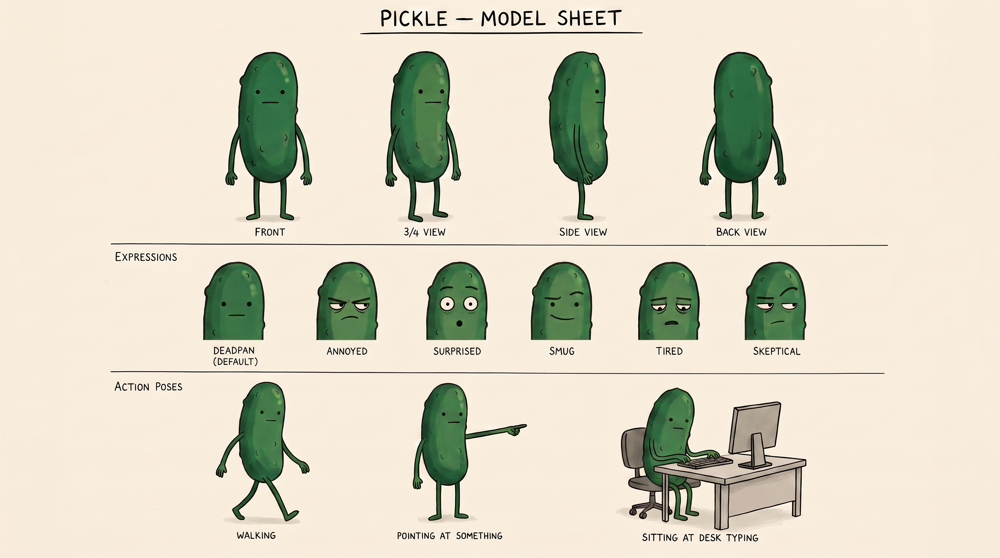

  

<h1 align="center">Merhaba, ben Ali 👋</h1>

  Yazılım projeleri geliştiriyor, öğreniyor ve ürettiklerimi burada topluyorum.
   
  Turşu kod inceleme ekibinde.

  <a href="https://github.com/AliBal7?tab=repositories"><b>Projeler</b></a>
  &nbsp;&nbsp;·&nbsp;&nbsp;
  <a href="https://github.com/AliBal7"><b>GitHub profili</b></a>

 

<table>
  <tr>
    <td width="68%" valign="middle">
      <h2>Burada ne var?</h2>
      

        Deneysel çalışmalar, ders projeleri ve üzerinde çalıştığım ürün fikirleri.
        Profil, gösterişli ama boş bir teknoloji listesi yerine doğrudan repolara yönlendiriyor.
      

      

        <code>BUILDING</code>&nbsp;
        <code>LEARNING</code>&nbsp;
        <code>SHIPPING</code>
      

    </td>
    <td width="32%" align="center" valign="middle">
      
       
      <b>TURŞU</b> · sessiz kod gözlemcisi
    </td>
  </tr>
</table>

 

## Projeler

| Proje | Not |
| --- | --- |
| **[PledgePay](https://github.com/AliBal7/PledgePay)** | Geliştirme çalışması |
| **[İÜ Yemek](https://github.com/AliBal7/iu_yemek)** | Uygulama projesi |

 

  

